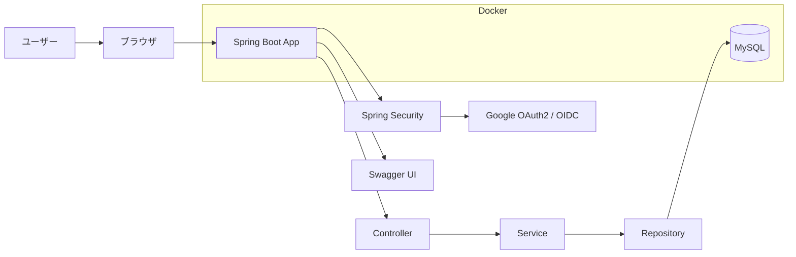

# HR Management System

## 概要

Java / Spring Boot を用いた業務系Webアプリケーションです。  
社員情報、部署情報、ユーザー情報を管理できる人事管理システムとして作成しました。

Googleアカウントログイン、権限管理、検索、ページネーション、Swagger、Docker環境を実装しています。

---

## 主な機能

- Googleログイン
- ロール管理（ADMIN / USER）
- 社員管理
- 部署管理
- ユーザー管理（ADMINのみ）
- 社員検索
- ページネーション
- Swagger APIドキュメント
- Docker Composeによる起動環境

---

## 使用技術

| 分類 | 技術 |
|---|---|
| Backend | Java 17, Spring Boot |
| Security | Spring Security, OAuth2 / OIDC |
| Database | MySQL |
| ORM | Spring Data JPA |
| View | Thymeleaf, Bootstrap |
| API Docs | Swagger / OpenAPI |
| Container | Docker, Docker Compose |
| Build | Maven |

---

## ER図

## アプリケーション構成
    src/main/java/com/portfolio/hr_system
    
    controller
    画面遷移・リクエスト制御
    
    service
    業務処理・トランザクション管理
    
    repository
    DBアクセス
    
    entity
    DBテーブル定義
    
    dto
    画面/API用データ受け渡し
    
    config
    Spring Security設定
    
    exception
    共通例外処理

## 起動方法
1. リポジトリ取得

    git clone <repository-url>
    cd hr-system
2. 環境設定

    src/main/resources/application-local.properties を作成します。
    spring.datasource.url=jdbc:mysql://localhost:3306/hr_portfolio
    spring.datasource.username=root
    spring.datasource.password=your_password
    
    spring.security.oauth2.client.registration.google.client-id=your_client_id
    spring.security.oauth2.client.registration.google.client-secret=your_client_secret
    spring.security.oauth2.client.registration.google.scope=openid,email,profile
3. Docker起動
   docker compose up --build
4. アクセス
   http://localhost:8080
   Swagger UI:http://localhost:8080/swagger-ui.html

## セキュリティ対応
    Google Client SecretはGit管理対象外
    DBパスワードはローカル設定ファイルで管理
    ADMIN / USERによる権限制御
    ユーザー管理画面はADMINのみアクセス可能

## 実装上のポイント
    Spring Security OAuth2 / OIDC によるGoogleログイン
    DB上のroleをSpring Securityの権限へ反映
    JPA EntityGraphによるN+1問題対策
    DTOによるEntityと画面/APIデータの分離
    GlobalExceptionHandlerによる共通エラーハンドリング
    Pageableによるページネーション
    Docker Composeによる環境構築