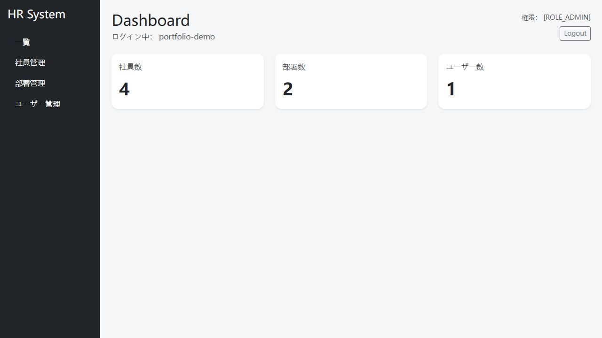
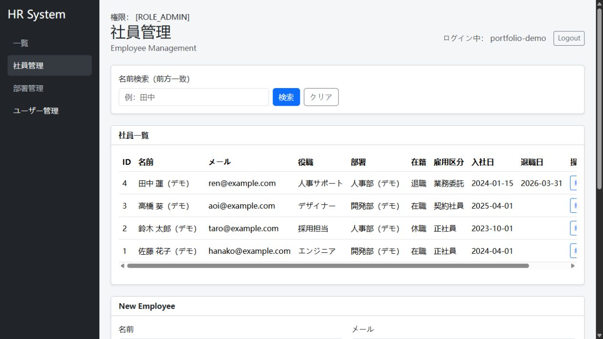
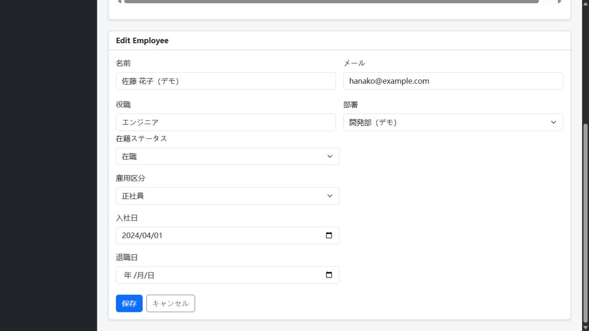
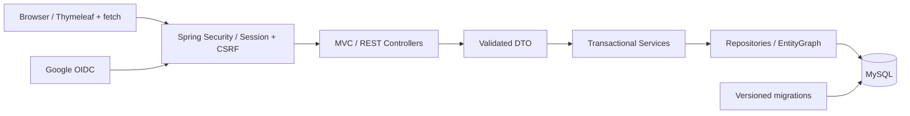
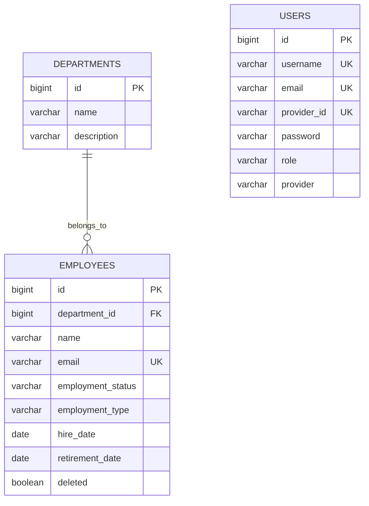
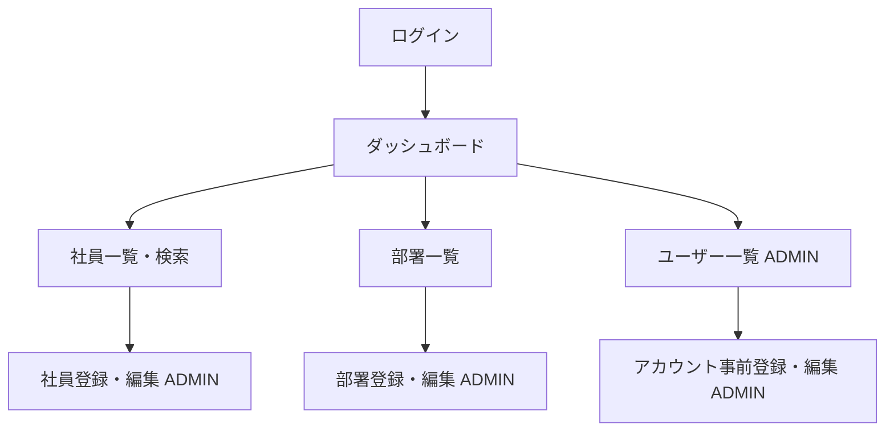

# HR Management System

Java 17 / Spring Boot 3.5 による社員・部署・アカウント管理アプリです。Thymeleaf の管理画面と、同じセッション認証を使う REST API を提供します。

## 機能と権限

| 操作 | USER | ADMIN |
| --- | --- | --- |
| ダッシュボード・社員・部署の閲覧 | 可 | 可 |
| 社員・部署の登録・更新・削除 | 不可 | 可 |
| ローカル／Google アカウントの事前登録 | 不可 | 可 |
| Swagger（明示的に有効化した環境） | 不可 | 可 |

社員は名前の前方一致検索とページングに対応します。在籍状態（在職／休職／退職）、雇用区分、入社日、退職日を管理できます。退職状態には退職日が必要で、入社日より前の日付は登録できません。

社員の削除は論理削除です。通常の検索・詳細・集計から除外し、メールの一意制約は削除後も保持します。社員・部署・ユーザーには作成日時、更新日時、作成者、更新者を記録します。これは更新者の追跡用メタデータであり、変更履歴をすべて保存する監査台帳ではありません。

## 画面例

以下はローカルで起動したアプリの実画面です。社員名・部署名はすべて架空のデモデータで、メールは `example.com` を使用しています。公開デモ用アカウントではありません。

ダッシュボードでは社員・部署・アカウントの件数を確認できます。



社員一覧では在籍状態・雇用区分・入社日・退職日をまとめて確認できます。名前検索は前方一致です。幅が足りない場合は表を横スクロールでき、日付やステータスは途中で改行しません。



管理者は一覧の「編集」から、既存情報を読み込んだフォームで人事情報を更新できます。



## 起動（Docker）

Docker Engine と Docker Compose が必要です。Google の認証情報はローカル認証だけで試す場合は不要です。

```sh
git clone https://github.com/SakuraLightL/hr-management-system.git
cd hr-management-system
cp .env.example .env
# .env の3つのパスワードを、それぞれ別の値に変更する
docker compose up --build
```

[ログイン画面](http://localhost:8080/login)を開き、`.env` の `BOOTSTRAP_ADMIN_USERNAME` / `BOOTSTRAP_ADMIN_PASSWORD` でログインしてください。初期管理者はユーザーテーブルが空の場合だけ作成され、再起動で既存パスワードを上書きしません。作成後は bootstrap 用の環境変数を削除して通常起動できます（Compose の必須指定も外してください）。

Compose はアプリを `127.0.0.1:8080` にのみ公開します。MySQL データは `mysql-data` ボリュームに保存します。既存環境からの更新では、先に下記の移行手順を確認してください。

## 起動（Java 17 / MySQL）

1. MySQL 8 を用意し、空の `hr_portfolio` データベースと、そのDBにアクセスできる `hr_app` ユーザーを作成します。
2. `src/main/resources/application-local.properties.example` を同じ場所の `application-local.properties` にコピーします。
3. DB 接続設定と環境変数を設定します。

```sh
export DB_PASSWORD='your-database-password'
export BOOTSTRAP_ADMIN_USERNAME='admin'
export BOOTSTRAP_ADMIN_PASSWORD='your-strong-admin-password'
./mvnw spring-boot:run -Dspring-boot.run.profiles=local
```

Windows PowerShell では `$env:DB_PASSWORD = '...'` のように設定し、`./mvnw.cmd spring-boot:run '-Dspring-boot.run.profiles=local'` を使用します。ローカル設定は Git 管理対象外です。`ddl-auto=validate` と Flyway を使うため、起動時にスキーマ変更を自動推測しません。

## Google ログイン

ローカル設定例の Google client-id / client-secret / scope を有効化し、環境変数 `GOOGLE_CLIENT_ID` と `GOOGLE_CLIENT_SECRET` を設定します。Google 側のリダイレクト URI は `http://localhost:8080/login/oauth2/code/google` です。設定がない場合はGoogleログインボタンを表示しません。

管理者がユーザー画面で認証方式 `GOOGLE`、メール、権限、重複しないユーザー名を事前登録します。ログイン時は `email_verified=true` と事前登録済みメールを要求し、初回ログインで Google の subject を固定します。未登録アカウントは自動登録せず、LOCAL アカウントへのメールによる自動連携もしません。既存の認証方式・連携済みメールを変更する場合は、別アカウントとして管理者が明示的に登録してください。

## API・セキュリティ

- ページと REST API の両方で CSRF 保護を有効化しています。書き込みは管理者権限とセッションの CSRF トークンが必要です。
- Thymeleaf の POST フォームはトークンを自動送信します。JavaScript はページの meta タグからトークンを取得し、`X-CSRF-TOKEN` ヘッダーを送信します。
- 削除とログアウトは POST（API の社員削除は DELETE）です。GET は削除を実行しません。
- API の値は `textContent` で表示し、HTML として解釈しません。
- 編集画面へパスワードハッシュを返しません。既存LOCALアカウントのパスワード欄を空にすると現在の値を維持します。
- API は DTO を返し、正常時は200（作成は201）、未認証401、権限不足・CSRF不正403、入力不正400、未検出404、重複・参照整合性違反409を返します。
- `/api/departments` は社員一覧と同じ `data.content` / `data.totalPages` 形式のページレスポンスです。最大ページサイズは100です。
- API レスポンスの `status/message/data` 形式は既存クライアントとの互換性のため維持しています。
- Swagger は既定で無効です。local 設定例でのみ有効化し、[Swagger UI](http://localhost:8080/swagger-ui/index.html) にはADMINログインが必要です。
- 通常はINFOログのみで、SQL表示とOpen Session in Viewは無効です。社員名・メール・OIDC属性をアプリログへ出力しません。

公開環境では HTTPS を終端するリバースプロキシを用意し、`prod` プロファイルを有効化してください。Secure Cookie を使うため、`prod` はHTTPだけのローカルデモ向けではありません。実在する社員情報を公開デモに投入しないでください。

## データベース移行

新規DBは Flyway の V1 → V2 を自動適用します。以前の `ddl-auto=update` で作ったDBを使う場合は [移行手順](docs/database-migration.md) に従ってバックアップ・重複確認・baseline を行ってください。`baseline-on-migrate` は既定で無効です。過去の行の監査日時は不明なのでNULLのまま保持します。

## 構成と設計意図

Thymeleaf は小規模な管理画面をサーバー側バリデーション・認証と一体で作るために採用しました。社員一覧のREST操作は、画面とAPIで同じ業務ルールと認可境界を共有する例です。OIDCは外部認証とアプリ内の権限・事前登録を分けるために使っています。


```mermaid
flowchart LR
  Browser[Browser / Thymeleaf + fetch] --> Security[Spring Security / Session + CSRF]
  Google[Google OIDC] --> Security
  Security --> Controllers[MVC / REST Controllers]
  Controllers --> DTO[Validated DTO]
  DTO --> Services[Transactional Services]
  Services --> JPA[Repositories / EntityGraph]
  JPA --> DB[(MySQL)]
  Flyway[Versioned migrations] --> DB
```


```mermaid
erDiagram
  DEPARTMENTS ||--o{ EMPLOYEES : belongs_to
  DEPARTMENTS {
    bigint id PK
    varchar name
    varchar description
  }
  EMPLOYEES {
    bigint id PK
    bigint department_id FK
    varchar name
    varchar email UK
    varchar employment_status
    varchar employment_type
    date hire_date
    date retirement_date
    boolean deleted
  }
  USERS {
    bigint id PK
    varchar username UK
    varchar email UK
    varchar provider_id UK
    varchar password
    varchar role
    varchar provider
  }
```

3テーブルには共通の `created_at / updated_at / created_by / updated_by` もあります。ユーザーはログイン用アカウントであり、社員レコードとは独立です。


```mermaid
flowchart TD
  Login[ログイン] --> Dashboard[ダッシュボード]
  Dashboard --> Employees[社員一覧・検索]
  Dashboard --> Departments[部署一覧]
  Dashboard --> Users[ユーザー一覧 ADMIN]
  Employees --> EmployeeForm[社員登録・編集 ADMIN]
  Departments --> DepartmentForm[部署登録・編集 ADMIN]
  Users --> UserForm[アカウント事前登録・編集 ADMIN]
```

## テスト

```sh
./mvnw --batch-mode --no-transfer-progress verify
node --test src/test/js/*.test.cjs
```

JavaのテストはH2のMySQL互換モードで実際のFlyway SQLを適用し、セキュリティフィルター・MVCテンプレート・JPAをまとめて検証します。さらにOIDCとパスワードのユニットテスト、Node標準テストランナーによるXSS・CSRFの回帰テストを実行します。GitHub ActionsでもJava 17で同じチェックを行います。H2の検証はMySQL実機の検証を代替するものではありません。

API互換性、認証、データ管理の設計判断は [設計方針](docs/design-decisions.md) を参照してください。
